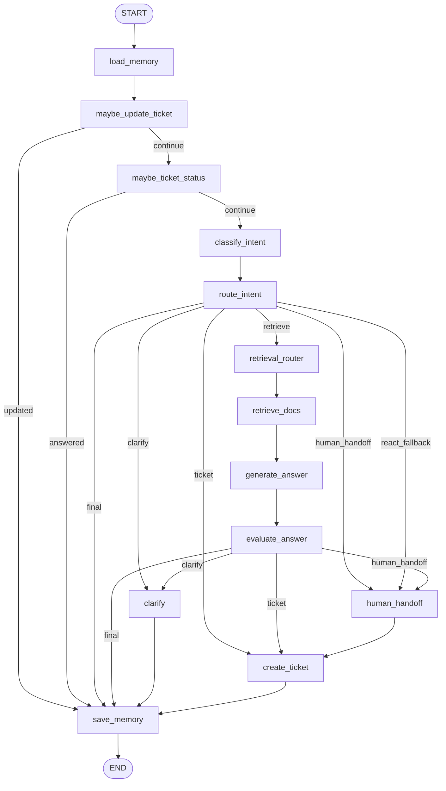

# Intelligent Customer Agent Technical Design

## 1. 文档目的

本文档说明 `intelligent_customer_agent` 的技术设计、模块边界、运行流程、数据模型、Guardrails、评测与运维方案。

项目目标是实现一个基于 LangGraph + RAG + FastAPI + Harness 工程实践的智能客服 Agent，满足第 12 讲选题 A 的核心要求，并在此基础上补充客服工作台、可观测性、知识缺口闭环、质量门禁和容器部署能力。

## 2. 背景与目标

### 2.1 业务场景

系统面向 SaaS 产品客服场景，用户可能提出：

- 产品或服务问题：账号、订单、发票、支付、退款、套餐、权限、报表、SLA 等。
- 多轮追问：先问套餐差异，再问 SLA 或价格细节。
- 模糊问题：如“这个怎么办”“帮我看看”。
- 投诉问题：如客服态度差、重复扣费、没人处理。
- 超出知识库范围的问题：如股票、天气、医疗、法律建议。

### 2.2 设计目标

优先级按项目要求排序：

1. 可运行：FastAPI 服务、`/chat` 接口和前端页面可以稳定演示。
2. 可测试：核心路径有 pytest 覆盖。
3. 可评测：独立评测脚本输出可复现指标。
4. 可观测：每次请求有 trace、事件、指标和审计回放。
5. 可运营：支持工单处理、知识缺口、知识库更新和质量门禁。

### 2.3 非目标

当前版本不追求以下能力：

- 不实现真正的企业级数据库、消息队列或分布式任务系统。
- 不默认依赖在线 LLM，避免实验环境 API 不稳定影响验收。
- 不实现复杂向量数据库，当前 RAG 采用轻量级本地索引，优先保证可复现。
- 不实现真实客服坐席权限系统，只提供可选 `ADMIN_API_KEY` 管理接口保护。

## 3. 需求覆盖

### 3.1 老师第 12 讲选题 A

| 要求 | 当前实现 |
| --- | --- |
| 基于知识库回答产品/服务问题 | `data/knowledge_base` 中 10 份 Markdown 文档，`scripts/build_kb.py` 构建本地索引，`/chat` 通过 RAG 回答 |
| 支持多轮对话并澄清模糊问题 | `data/memory.json` 保存 session history；短追问通过 `rewrite_contextual_query` 改写；模糊问题走 `clarify` |
| 识别用户意图：问答、投诉、咨询 | `classify_intent_node` 识别 `qa`、`consult`、`complaint`、`unclear`、`out_of_scope` |
| 无法回答时生成工单转人工 | `evaluate_answer_node` 检查证据和置信度，低置信度或无证据走 `human_handoff` 并创建工单 |
| RAG 知识库至少 10 份文档 | `faq_01/02`、`manual_01/02`、`policy_01/02`、`product_01/02`、`troubleshoot_01/02` |
| LangGraph 流程编排：意图分类 -> 路由 -> 处理 | `intelligent_customer/graph.py` 使用 `StateGraph` 显式建模节点和条件边 |
| FastAPI 部署 | `intelligent_customer/api.py` 提供 HTTP API；`scripts/run_api.sh`、Dockerfile、docker-compose 可启动 |
| 评测集 + 评测脚本 | `evals/eval_dataset.jsonl` 和 `evals/run_eval.py`，当前 32 条 case |

### 3.2 Harness 工程风格

| Harness 要求 | 当前实现 |
| --- | --- |
| 状态和启动管理 | `feature_list.json`、`progress.md`、`init.sh`、`AGENTS.md` |
| 工具边界 | `tools/memory_tool.py`、`ticket_tool.py`、`kb_search_tool.py`、`knowledge_gap_tool.py`、`evaluation_tool.py` |
| Guardrails | `harness/guardrails.py`，投诉强制工单、无证据不编造、低置信度转人工 |
| 独立评测脚本 | `evals/run_eval.py` 不让主 Agent 自评 |
| Trace 和 metrics | `trace_id`、`logs/events.ndjson`、`logs/metrics.json`、`/metrics`、`/audit/{trace_id}` |
| LangGraph 显式状态 | `harness/state.py` 定义 `AgentState`，`graph.py` 定义节点和条件边 |

## 4. 总体架构

```text
User / Browser / curl
        |
        v
FastAPI app
  /chat /metrics /audit /tickets /kb /eval
        |
        v
LangGraph Agent
  load_memory
  maybe_update_ticket
  maybe_ticket_status
  classify_intent
  route_intent
  retrieval_router
  retrieve_docs
  generate_answer
  evaluate_answer
  clarify / create_ticket / human_handoff
  save_memory
        |
        +-------------------+
        |                   |
        v                   v
RAG Knowledge Base      Harness Tools
  Markdown docs           memory
  kb_index.json           tickets
  tokenizer/scorer        observability
  query normalizer        privacy
  search lab              security
                            |
                            v
                    data/*.json/jsonl
                    logs/events.ndjson
                    logs/metrics.json
```

系统采用分层设计：

- API 层：FastAPI 负责 HTTP schema、限流、Admin Key 校验和静态前端托管。
- Agent 编排层：LangGraph 负责状态机、节点执行顺序和条件路由。
- RAG 层：本地知识库索引、集合路由、检索评分和证据句重排。
- 工具层：封装记忆、工单、知识库管理、知识缺口、评测等副作用。
- Harness 层：封装 guardrails、可观测性、隐私脱敏、安全和文件锁。
- 前端层：聊天工作台和 Dashboard，支持演示和运营。

## 5. LangGraph 状态机设计

### 5.1 状态定义

`AgentState` 位于 `intelligent_customer/harness/state.py`。核心字段包括：

| 字段 | 说明 |
| --- | --- |
| `trace_id` | 每次请求唯一链路 ID |
| `session_id` | 多轮会话 ID |
| `message` | 用户当前输入 |
| `history` | 当前 session 的历史消息 |
| `memory_summary` | 最近对话摘要 |
| `intent` | 识别出的用户意图 |
| `route` | 当前处理路由 |
| `collections` | RAG 检索集合 |
| `contextual_query` | 结合上下文改写后的查询 |
| `retrieved_docs` | RAG 命中文档 |
| `evidence_count` | 证据数量 |
| `confidence` | 检索置信度 |
| `answer` | 最终回复 |
| `citations` | 引用来源 |
| `ticket_id` | 工单 ID |
| `need_human` | 是否需要人工 |
| `metadata` | 前端展示和审计需要的扩展信息 |
| `latency_ms` | 请求耗时 |

### 5.2 图结构



### 5.3 节点职责

| 节点 | 文件 | 职责 |
| --- | --- | --- |
| `load_memory` | `nodes/load_memory.py` | 读取 session 历史和摘要 |
| `maybe_update_ticket` | `nodes/maybe_update_ticket.py` | 用户补充订单号/联系方式时更新已有打开工单 |
| `maybe_ticket_status` | `nodes/maybe_ticket_status.py` | 识别“查询工单状态”并直接回复 |
| `classify_intent` | `nodes/classify_intent.py` | 基于规则和口语归一化识别意图 |
| `route_intent` | `nodes/route_intent.py` | 根据 guardrail 路由到 RAG、澄清、工单或人工 |
| `retrieval_router` | `nodes/retrieve_docs.py` | 结合上下文决定检索 query 和集合 |
| `retrieve_docs` | `nodes/retrieve_docs.py` | 调用 `kb_search`，计算证据数和置信度 |
| `generate_answer` | `nodes/generate_answer.py` | 基于证据生成 grounded 回复和 citations |
| `evaluate_answer` | `nodes/evaluate_answer.py` | 检查证据和置信度，决定最终/澄清/转人工 |
| `clarify` | `nodes/clarify.py` | 对模糊问题提出澄清问题 |
| `create_ticket` | `nodes/create_ticket.py` | 创建投诉或人工处理工单 |
| `human_handoff` | `nodes/human_handoff.py` | 无法回答时转人工并复用工单创建逻辑 |
| `save_memory` | `nodes/save_memory.py` | 保存对话、记录指标和最终事件 |

## 6. 意图识别与路由设计

### 6.1 意图类型

`schemas.py` 中定义：

```text
qa | consult | complaint | unclear | out_of_scope
```

含义：

- `qa`：知识库问答，例如退款、账号、发票、登录。
- `consult`：咨询类，例如价格、套餐、SLA、购买建议。
- `complaint`：投诉类，必须走工单。
- `unclear`：信息不足，需要澄清。
- `out_of_scope`：超出当前客服知识范围，转人工。

### 6.2 路由类型

```text
retrieve | clarify | ticket | human_handoff | react_fallback | final
```

主要规则位于 `harness/guardrails.py`：

- `complaint -> ticket`
- `unclear -> clarify`
- `out_of_scope -> human_handoff`
- `qa/consult -> retrieve`
- 未知情况默认 `human_handoff`

### 6.3 口语归一化

`rag/query_normalizer.py` 把用户真实表达映射到知识库概念，例如：

- “退钱”“退回来”“什么时候返钱” -> “退款 到账 退换货”
- “短信码”“动态码”“收不到码” -> “验证码 登录失败”
- “开票”“发票抬头填错” -> “发票 订单”
- “一直转圈”“打不开页面” -> “登录失败 故障”
- “看不到报表” -> “权限 报表”

这样可以减少真实用户表达和知识库术语不一致导致的漏召回。

## 7. RAG 设计

### 7.1 知识库

知识库存放在 `data/knowledge_base/`，当前 10 份 Markdown：

```text
faq_01.md
faq_02.md
manual_01.md
manual_02.md
policy_01.md
policy_02.md
product_01.md
product_02.md
troubleshoot_01.md
troubleshoot_02.md
```

集合类型：

```text
faq | policy | manual | troubleshoot | product
```

每份文档使用 frontmatter 描述 `source_id`、`title`、`collection`、`updated_at`，正文作为检索内容。

### 7.2 索引构建

`scripts/build_kb.py` 调用 `rag/kb_builder.py`：

1. 读取 Markdown。
2. 解析 frontmatter。
3. 对标题和正文分词。
4. 生成 `data/kb_index.json`。

分词策略：

- 英文和数字 token。
- 中文单字 token。
- 中文 bigram、trigram。
- 已知业务词增强，例如“退款”“验证码”“报表”“SLA”等。

该设计不依赖外部向量库，适合课程项目验收和离线可复现评测。

### 7.3 检索流程

`rag/retriever.py` 的 `search_kb` 负责检索：

1. 对 query 执行 `expand_query`。
2. 通过 `rag/router.py` 选择集合。
3. 对候选文档计算 token 和短语命中得分。
4. 按分数排序返回 top-k。
5. 返回 `source_id`、`title`、`collection`、`score`、`snippet`、`path`。

`nodes/retrieve_docs.py` 根据 top score、平均 score 和证据数量计算 `confidence`，并在显式业务词命中时提高最低置信度。

### 7.4 答案生成

默认采用离线 grounded RAG，保证测试和评测可复现。

`nodes/generate_answer.py` 的策略：

1. 只使用检索到的知识库证据。
2. 过滤支持当前问题的文档。
3. 对证据句按问题相关性重排。
4. 生成带编号的客服回复。
5. 附上 `依据来源` 和下一步提示。
6. 返回 citations，其中包含证据片段 snippet。

证据句重排会优先考虑：

- query token 命中。
- 显式业务词命中。
- 文档标题相关性。
- 文档检索分数。
- 关键时效和处理条件，例如退款 `3 到 7 个工作日`、验证码 `10 分钟安全限制`、发票 `30 天`、SLA `99.9%` 和 `4 小时`。

### 7.5 可选 LLM

`.env` 可配置：

```text
OPENAI_API_KEY
OPENAI_BASE_URL
OPENAI_MODEL
USE_LLM_ANSWERS=1
```

只有在 `USE_LLM_ANSWERS=1` 且有 API Key 时，`llm.py` 才会调用在线模型对已有证据进行 grounded answer 润色。

重要约束：

- LLM 不能绕过投诉强制工单。
- 无证据、低置信度、超范围仍由 guardrails 接管。
- 评测脚本会临时关闭 LLM，确保结果可复现。

## 8. Guardrails 设计

Guardrails 是本项目的关键设计，不依赖提示词自觉遵守，而是由代码路径强制执行。

### 8.1 投诉必走工单

`route_for_intent` 中：

```text
complaint -> ticket
```

投诉不会进入 RAG 回复路径，避免客服机器人对投诉敷衍回答。

### 8.2 无证据不编造

`evaluate_answer_policy` 中：

```text
evidence_count <= 0 -> human_handoff
```

没有知识库证据时不会生成“看起来合理”的答案，而是创建人工处理单。

### 8.3 低置信度转人工或澄清

```text
confidence < MIN_CONFIDENCE:
  ambiguous -> clarify
  otherwise -> human_handoff
```

默认 `MIN_CONFIDENCE=0.28`，可通过 `.env` 配置。

### 8.4 模糊问题澄清

`is_ambiguous_message` 检查短句和模糊词，例如“这个”“怎么办”“帮我看看”。如果没有足够业务上下文，则走 `clarify`。

### 8.5 隐私脱敏

`harness/privacy.py` 对日志、工单正文、工单备注中的手机号、邮箱、长数字凭证做遮罩。工单中保留 `contact_masked` 供客服跟进。

## 9. 工单与人工接手设计

### 9.1 工单类型

`tools/ticket_tool.py` 创建两类工单：

- `T-*`：投诉工单，来自 `complaint`。
- `H-*`：人工处理单，来自无证据、低置信度或超范围问题。

工单存储在 `data/tickets.jsonl`。

### 9.2 字段抽取

`tools/ticket_extractor.py` 从用户输入中抽取：

- 订单号。
- 联系方式掩码。
- 联系方式类型。
- 问题类型。
- 紧急程度。
- 优先级。
- SLA 小时数。

### 9.3 多轮补充

当同一 session 中存在打开工单时，`maybe_update_ticket_node` 会优先检查用户是否补充了订单号或联系方式。

如果补充成功：

1. 更新原工单。
2. 记录 `ticket.enriched` 事件。
3. 直接回复“已补充到工单”。
4. 不重新创建新工单。

### 9.4 工单状态查询

用户可以问：

- “查看工单状态”
- “处理到哪了”
- “帮我查一下 T-xxx 的进度”

`maybe_ticket_status_node` 会查当前 session 最近工单或显式工单号，并返回：

- 状态。
- 优先级。
- 问题类型。
- SLA 剩余时间或超时提示。
- 订单号和联系方式是否已记录。
- 负责人。
- 仍缺失的字段。

### 9.5 人工接手摘要

`tools/handoff_tool.py` 会为工单 metadata 生成 handoff summary，包含：

- 当前问题。
- 最近对话。
- intent/route/confidence。
- 证据来源。
- 缺失字段。
- 抽取字段。
- 下一步建议。

Dashboard 可以直接展示这些信息，方便人工客服接手。

## 10. 记忆与多轮对话

### 10.1 存储

会话记忆存放在 `data/memory.json`。

每个 session 保存：

- `messages`：用户和助手消息。
- `summary`：最近消息压缩摘要。

`MAX_HISTORY_MESSAGES` 默认 20，可通过 `.env` 配置。

### 10.2 上下文改写

`tools/context_tool.py` 的 `rewrite_contextual_query` 支持短追问，例如：

1. 用户：“专业版和企业版有什么区别？”
2. 用户：“那 SLA 呢？”

第二个问题会结合历史上下文改写，检索时保留“企业版/套餐”等语境。

### 10.3 会话列表

`/sessions` 返回：

- `session_id`
- `message_count`
- `title`
- `summary`
- `last_updated`
- `last_intent`
- `last_route`
- `ticket_id`
- `need_human`

聊天页侧边栏可以搜索和按状态筛选多个会话。

## 11. API 设计

### 11.1 核心接口

| 方法 | 路径 | 说明 |
| --- | --- | --- |
| GET | `/health` | 健康检查 |
| POST | `/chat` | 主聊天接口 |
| POST | `/reset` | 重置 session |
| GET | `/sessions` | 会话列表 |
| GET | `/sessions/{session_id}/history` | 会话历史 |
| DELETE | `/sessions/{session_id}` | 删除会话 |

### 11.2 工单接口

| 方法 | 路径 | 说明 |
| --- | --- | --- |
| GET | `/tickets` | 工单列表 |
| PATCH | `/tickets/{ticket_id}` | 更新工单状态，需要 Admin Key |
| GET | `/tickets/stats` | 工单统计 |
| POST | `/escalate` | 手动创建人工处理单 |

### 11.3 知识库接口

| 方法 | 路径 | 说明 |
| --- | --- | --- |
| GET | `/kb/docs` | 知识库文档列表 |
| GET | `/kb/docs/{source_id}` | 查看单份文档 |
| GET | `/kb/search` | RAG 检索调试 |
| POST | `/kb/docs` | 新增知识文档，需要 Admin Key |
| POST | `/kb/rebuild` | 重建索引，需要 Admin Key |

### 11.4 质量与观测接口

| 方法 | 路径 | 说明 |
| --- | --- | --- |
| GET | `/metrics` | 运行指标 |
| GET | `/audit/{trace_id}` | 按 trace 回放事件 |
| GET | `/events/recent` | 最近事件 |
| POST | `/feedback` | 用户反馈 |
| GET | `/knowledge-gaps` | 知识缺口列表 |
| GET | `/knowledge-gaps/stats` | 知识缺口统计 |
| PATCH | `/knowledge-gaps/{gap_id}` | 更新知识缺口，需要 Admin Key |
| POST | `/knowledge-gaps/{gap_id}/eval-case` | 缺口转评测草稿，需要 Admin Key |
| GET | `/eval/report` | 最新评测报告 |
| POST | `/eval/run` | 触发独立评测，需要 Admin Key |
| GET | `/eval/generated-cases` | 查看自动生成评测草稿 |

### 11.5 `/chat` schema

请求：

```json
{
  "message": "我想退款，怎么处理？",
  "session_id": "demo",
  "user_id": "u001"
}
```

响应：

```json
{
  "trace_id": "trace_xxx",
  "session_id": "demo",
  "intent": "qa",
  "route": "retrieve",
  "reply": "可以，我查到的退款处理规则是：...",
  "confidence": 0.73,
  "citations": [
    {
      "source_id": "policy_01",
      "title": "退款与退换货政策",
      "collection": "policy",
      "score": 0.82,
      "snippet": "退款申请需要提供订单号..."
    }
  ],
  "ticket_id": null,
  "need_human": false,
  "metadata": {
    "latency_ms": 12.34,
    "evidence_count": 2,
    "need_clarification": false,
    "suggested_actions": ["查询退款进度", "联系人工"]
  }
}
```

## 12. 可观测性设计

### 12.1 事件日志

每个关键节点调用 `log_event` 写入 `logs/events.ndjson`。

典型 stage：

```text
chat.request
memory.loaded
intent.classified
route.decided
rag.collections_routed
rag.retrieved
answer.generated
answer.evaluated
ticket.created
ticket.enriched
ticket.status_lookup
memory.saved
chat.response
feedback.received
knowledge_gap.recorded
eval.completed
kb.search
```

每条事件包含：

- `ts`
- `trace_id`
- `session_id`
- `stage`
- stage-specific fields

### 12.2 指标

`logs/metrics.json` 保存：

- 总请求数。
- intent 分布。
- route 分布。
- 延迟列表。
- 工单数量。
- fallback 数量。
- 澄清数量。
- 反馈分布。

`/metrics` 返回：

- `avg_latency_ms`
- `p95_latency_ms`
- `fallback_rate`
- `clarification_rate`
- `top_intents`
- `recent_event_count`

### 12.3 Trace 审计

`/audit/{trace_id}` 会从 `events.ndjson` 中筛选同一个 trace 的所有事件，用于答辩展示“为什么这次回复会这么走”。

## 13. 知识缺口闭环

知识缺口存放在 `data/knowledge_gaps.jsonl`。

触发来源：

- 无证据或低置信度转人工。
- 用户对答案点差评。

运营流程：

1. Dashboard 查看 gap。
2. 通过 trace 回放定位原因。
3. 将 gap 转为评测草稿。
4. 人工确认后补充知识库 Markdown。
5. 调用 `/kb/rebuild` 重建索引。
6. 重新运行 `/eval/run` 验证质量。

该流程把“不聪明”的用户反馈转成可改进的知识库和评测资产。

## 14. 前端设计

### 14.1 聊天工作台

入口：

```text
http://127.0.0.1:8011/
```

能力：

- 多会话恢复。
- 新建会话。
- 会话搜索和状态筛选。
- Enter 发送。
- 中文输入法组合态保护。
- 发送中状态。
- 失败重试。
- 消息时间和响应耗时。
- 引用卡片。
- 工单号展示和复制。
- trace 复制。
- 答案反馈及差评原因。
- suggested actions 快捷提问。
- Session Insight 面板展示 intent、route、confidence、evidence、ticket、contextual query。

### 14.2 Dashboard

入口：

```text
http://127.0.0.1:8011/web/dashboard.html
```

能力：

- 指标概览。
- 工单列表和状态处理。
- SLA 超时高亮。
- 最近事件。
- trace 审计回放。
- 知识缺口管理。
- 缺口转评测。
- 知识库新增文档。
- 重建索引。
- Search Lab 检索调试。
- Quality Gate 评测报告和触发评测。

## 15. 安全设计

### 15.1 Admin Key

`harness/security.py` 提供 `require_admin_key`。

当 `.env` 设置：

```text
ADMIN_API_KEY=<your-admin-key>
```

以下写接口需要请求头：

```text
X-Admin-Key: <your-admin-key>
```

受保护接口包括：

- `PATCH /tickets/{ticket_id}`
- `PATCH /knowledge-gaps/{gap_id}`
- `POST /knowledge-gaps/{gap_id}/eval-case`
- `POST /kb/docs`
- `POST /kb/rebuild`
- `POST /eval/run`

### 15.2 限流

`/chat` 调用 `check_rate_limit`，默认：

```text
RATE_LIMIT_PER_MINUTE=60
```

限流 key 基于客户端 IP 和 user/session fallback。

### 15.3 隐私

隐私策略：

- 日志写入前调用 `sanitize_fields`。
- 工单 message 和 notes 调用 `mask_sensitive_text`。
- 会话列表 title/summary 做脱敏。
- Docker Compose 默认不注入 `.env`，避免密钥被日志或配置导出泄露。

## 16. 持久化与并发

当前使用本地文件存储，适合课程项目和单机演示。

| 数据 | 文件 |
| --- | --- |
| 知识库 Markdown | `data/knowledge_base/*.md` |
| 知识库索引 | `data/kb_index.json` |
| 会话记忆 | `data/memory.json` |
| 工单 | `data/tickets.jsonl` |
| 知识缺口 | `data/knowledge_gaps.jsonl` |
| 事件 | `logs/events.ndjson` |
| 指标 | `logs/metrics.json` |
| 评测报告 | `evals/eval_report.json` |
| 生成评测草稿 | `evals/generated_eval_cases.jsonl` |

`harness/file_lock.py` 为 JSON/JSONL 写入增加 sidecar 文件锁，降低并发请求时的丢更新风险。

生产环境可迁移为：

- `memory.json` -> Redis 或 PostgreSQL。
- `tickets.jsonl` -> 工单系统或数据库。
- `events.ndjson` -> OpenTelemetry/ELK。
- `kb_index.json` -> 向量数据库或混合检索引擎。

## 17. 评测设计

### 17.1 评测集

`evals/eval_dataset.jsonl` 当前包含 32 条 case，覆盖：

- FAQ 问答。
- 咨询问题。
- 退款政策。
- 登录和支付故障。
- 投诉。
- 模糊问题澄清。
- 超范围转人工。
- 多轮上下文。
- 口语表达。
- 工单状态查询。
- 答案相关性。

### 17.2 评测脚本

`evals/run_eval.py` 独立调用 Agent，不依赖主 Agent 自评。

评测时会关闭 LLM 回答，保证：

- 不受网络影响。
- 不受模型随机性影响。
- 不消耗额外 token。
- 每次运行结果可复现。

### 17.3 指标

当前指标：

```text
total = 32
intent_accuracy = 1.0
route_accuracy = 1.0
ticket_success_rate = 1.0
fallback_accuracy = 1.0
clarification_accuracy = 1.0
keyword_hit_rate = 1.0
schema_valid_rate = 1.0
overall_score = 1.0
```

### 17.4 质量门禁

质量门禁入口：

- CLI：`python evals/run_eval.py`
- API：`GET /eval/report`
- API：`POST /eval/run`
- Dashboard：Quality Gate 面板

答辩现场可以先运行评测，再通过 Dashboard 展示分数和失败用例列表。

## 18. 部署设计

### 18.1 本地运行

```bash
bash init.sh
conda activate agent_course
python scripts/build_kb.py
pytest -q
python evals/run_eval.py
bash scripts/run_api.sh
```

服务地址：

```text
http://127.0.0.1:8011
```

### 18.2 Uvicorn

```bash
uvicorn intelligent_customer.api:app --host 0.0.0.0 --port 8011 --reload
```

`scripts/run_api.sh` 默认启用 reload，但只监控 `intelligent_customer/` 和 `web/`，避免日志或运行期数据变化导致服务重启。

### 18.3 Docker

```bash
docker compose up --build
```

容器启动时执行：

```text
python scripts/build_kb.py
uvicorn intelligent_customer.api:app --host 0.0.0.0 --port 8011
```

Compose 挂载：

```text
./data -> /app/data
./logs -> /app/logs
```

保证记忆、工单、知识缺口和日志在容器重启后保留。

## 19. 配置项

| 配置 | 默认值 | 说明 |
| --- | --- | --- |
| `MIN_CONFIDENCE` | `0.28` | 低于该置信度触发澄清或人工 |
| `RAG_TOP_K` | `4` | RAG 返回文档数 |
| `MAX_HISTORY_MESSAGES` | `20` | 每个 session 保留消息数 |
| `OPENAI_API_KEY` | 空 | 可选在线 LLM |
| `OPENAI_BASE_URL` | 空 | 可选 LLM endpoint |
| `OPENAI_MODEL` | `mock-rule-based` | 可选 LLM 模型名 |
| `USE_LLM_ANSWERS` | 空 | 设置为 `1` 时启用 LLM grounded answer |
| `LLM_TIMEOUT_SECONDS` | `5` | LLM 调用超时 |
| `ADMIN_API_KEY` | 空 | 管理写接口保护 |
| `RATE_LIMIT_PER_MINUTE` | `60` | `/chat` 限流 |

注意：`.env` 可以保存实验 API 信息，但不得提交真实密钥。README 和本文档只描述配置项，不展示真实值。

## 20. 测试覆盖

当前测试文件：

```text
test_api.py
test_context_tool.py
test_deployment.py
test_eval.py
test_graph.py
test_guardrails.py
test_handoff.py
test_persistence.py
test_privacy.py
test_rag.py
test_security.py
test_ticket_extractor.py
```

覆盖范围：

- API schema。
- LangGraph 路由。
- RAG 检索。
- Guardrails。
- 评测脚本。
- 隐私脱敏。
- 安全接口。
- 前端脚本语法和关键 UI 控件。
- 工单抽取和 SLA。
- 并发持久化文件锁。
- 人工接手摘要。

当前已验证：

```text
pytest -q -> 63 passed
python evals/run_eval.py -> 32 cases, overall_score = 1.0
python -m json.tool feature_list.json -> pass
```

## 21. 关键设计取舍

### 21.1 为什么默认不依赖在线 LLM

课程项目验收最重要的是可运行和可复现。默认离线规则 + RAG 可以保证：

- 没有 API Key 也能跑。
- 测试和评测结果稳定。
- 答辩现场不受网络波动影响。

同时保留 `USE_LLM_ANSWERS=1`，后续可以在证据充分时启用 LLM 润色。

### 21.2 为什么使用本地文件而不是数据库

本项目聚焦 Agent 工程实践和流程闭环。本地 JSON/JSONL 的优点：

- 易理解。
- 易演示。
- 易查看。
- 无额外服务依赖。

为了降低并发风险，已引入文件锁。生产环境迁移数据库时，工具层边界已经清晰，替换成本较低。

### 21.3 为什么用规则检索而不是向量库

当前知识库规模小，规则检索足够覆盖验收需求，并且可复现。真实生产可演进为：

- BM25 + embedding hybrid search。
- reranker。
- query rewrite LLM。
- 向量数据库。
- 知识库版本管理。

### 21.4 为什么用代码 Guardrails 而不是只写 prompt

投诉、无证据不编造、低置信度转人工属于关键行为，不应该依赖模型是否听话。用条件边和策略函数强制执行更可靠，也更符合 Harness 工程实践。

## 22. 已知限制

1. 本地文件存储不适合多实例水平扩展。
2. 检索算法是轻量规则检索，不具备大规模语义召回能力。
3. 意图识别主要基于规则和关键词，面对复杂语义可能需要 LLM classifier 或训练模型。
4. Dashboard 是演示级工作台，不是完整 RBAC 后台。
5. Admin Key 是简单共享密钥，生产应换成 OAuth/OIDC 或企业 SSO。
6. 当前没有真实消息通知、短信、邮件、CRM 或外部工单系统集成。

## 23. 后续演进路线

### 23.1 RAG 增强

- 引入 BM25 + embedding 混合检索。
- 引入 reranker。
- 给知识库文档增加 chunk 级索引。
- 增加知识库版本号和发布审批。
- 增加“答案引用必须覆盖每个关键结论”的验证。

### 23.2 Agent 智能增强

- 引入 LLM intent classifier，但保留规则 guardrails。
- 对用户问题做结构化槽位抽取。
- 使用 LangGraph 增加更细的工具调用分支。
- 对投诉和复杂咨询增加多步骤 ReAct，但限制工具边界。

### 23.3 生产运维增强

- 数据持久化迁移到 PostgreSQL/Redis。
- 事件接入 OpenTelemetry。
- 工单对接真实 CRM。
- 增加用户身份认证和权限。
- 增加灰度发布和回滚。

### 23.4 质量体系增强

- 自动从线上 trace 中采样生成评测候选。
- 区分 smoke eval、regression eval 和 challenge eval。
- 建立失败用例自动归因：分类错、检索错、生成错、知识缺失。
- 引入人工标注工作流。

## 24. 答辩展示建议

建议按以下顺序演示：

1. 启动项目：

```bash
bash init.sh
python scripts/build_kb.py
pytest -q
python evals/run_eval.py
bash scripts/run_api.sh
```

2. 打开聊天页：

```text
http://127.0.0.1:8011/
```

3. 演示知识库问答：

```text
我想退款，怎么处理？
短信码一直收不到
团队成员看不到报表怎么办？
```

4. 演示多轮上下文：

```text
专业版和企业版有什么区别？
那 SLA 呢？
```

5. 演示澄清：

```text
这个怎么办？
```

6. 演示投诉工单：

```text
我要投诉，订单号 ORD202606050001 重复扣费，请联系 13812345678。
```

7. 演示工单状态查询：

```text
查看工单状态
```

8. 演示超范围转人工：

```text
帮我预测明天股票走势。
```

9. 打开 Dashboard：

```text
http://127.0.0.1:8011/web/dashboard.html
```

展示：

- Metrics。
- Tickets。
- Audit trace。
- Knowledge Gaps。
- Search Lab。
- Quality Gate。

## 25. 总结

本项目不是单纯的聊天 demo，而是一个具备客服业务闭环的 Agent 工程实现：

- 用 LangGraph 明确建模流程。
- 用 RAG 和 citations 保证回答有证据。
- 用代码 guardrails 保证关键行为可靠。
- 用 FastAPI 和前端工作台支撑演示。
- 用 memory 和 ticket 实现多轮客服流程。
- 用 trace、events 和 metrics 提供可观测性。
- 用 knowledge gap、KB admin 和 eval 形成持续改进闭环。

当前版本已经完成课程核心要求，并具备向生产级客服 Agent 演进的清晰边界和路线。
