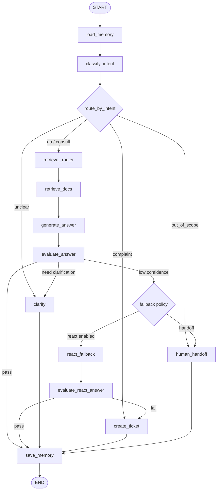

# Codex 任务目标书：基于 LangGraph + RAG + Harness 的智能客服 Agent

## 0. 给 Codex 的角色设定

你是负责完成毕业项目的工程 Agent。你的任务不是写一个临时 demo，而是端到端实现一个可运行、可部署、可评测、具备 Harness 工程风格的智能客服 Agent 项目。

请优先保证核心功能稳定可跑，然后再做增强项。

---

## 1. 项目最终目标

实现项目：

```text
intelligent_customer_agent
```

项目定位：

```text
基于 LangGraph 的企业级智能客服 Agent，支持 RAG 知识库问答、意图分类、多轮澄清、投诉工单、无法回答转人工、评测脚本、状态持久化和可观测日志。
```

最小闭环：

```text
用户输入
  -> 加载会话记忆
  -> 意图分类
  -> LangGraph 条件路由
  -> RAG 检索 / 澄清 / 工单 / 转人工
  -> 保存会话记忆
  -> 记录 trace 和 metrics
  -> FastAPI 返回结构化结果
```

---

## 2. 必须参考的文件

Codex 开始前必须先阅读这些文件。

### 2.1 主要求文件

```text
01_ASSIGNMENT_REQUIREMENTS.md
```

用途：这是老师第 12 讲毕业项目主要求整理版。它定义了硬性作业要求。本项目必须选择并完成：

```text
选题 A：智能客服 Agent
```

### 2.2 Harness 工程实践文件

```text
02_HARNESS_ENGINEERING_GUIDE.md
```

用途：这是老师要求参考的 Harness 工程实践整理版。它定义项目的工程质量标准，包括状态文件、工具边界、反馈验证、机械约束和可观测性。

### 2.3 具体实战参考 Word 文档

```text
具体实战参考.docx
```

用途：这是老师给的具体实战参考，不需要转换，但必须作为实现蓝图阅读。重点参考它的多轮迭代路线：

```text
第 1 轮：PRD -> TRD -> TDD -> Harness，全流程基础功能
第 2 轮：前后端项目完整
第 3 轮：添加记忆系统、ReAct、多跳、分库索引和路由
第 4 轮：添加可观测数据和监控大盘
第 5 轮：抽取 MCP 和 Skill，可作为高级加分项
第 6 轮：形成项目总结，用于答辩 / 面试表达
```

注意：如果 Word 文档中的高级功能与核心作业冲突，优先级如下：

```text
主作业硬要求 > Harness 工程可靠性 > Word 文档高级增强项
```

---

## 3. 功能范围

### 3.1 必须完成的核心功能

| 编号 | 功能 | 要求 |
|---|---|---|
| F001 | RAG 知识库问答 | 至少 10 份知识库文档，能检索并回答产品 / 服务问题。 |
| F002 | 意图分类 | 至少分类 `qa`、`consult`、`complaint`、`unclear`、`out_of_scope`。 |
| F003 | LangGraph 编排 | 使用 LangGraph 实现状态流和条件路由。 |
| F004 | 多轮对话 | 使用 `session_id` 保存和读取历史。 |
| F005 | 模糊问题澄清 | 对信息不足问题主动追问。 |
| F006 | 投诉工单 | 投诉类问题必须生成工单。 |
| F007 | 无法回答转人工 | 无证据、低置信度、超范围问题应转人工或生成工单。 |
| F008 | FastAPI 服务 | 提供 `/health`、`/chat` 等接口。 |
| F009 | 评测集 | 提供覆盖多场景的 `evals/eval_dataset.jsonl`。 |
| F010 | 评测脚本 | 提供 `evals/run_eval.py`，输出结构化指标。 |
| F011 | README | 写清启动、接口、示例、评测和项目结构。 |
| F012 | Harness 文件 | 提供 `feature_list.json`、`progress.md`、`init.sh`、`AGENTS.md`。 |

### 3.2 强烈建议完成的增强项

| 功能 | 要求 |
|---|---|
| 可观测性 | `trace_id`、`logs/events.ndjson`、`logs/metrics.json`、`/metrics`、`/audit/{trace_id}`。 |
| 前端聊天页 | 纯 HTML/CSS/JS 即可，能调用 `/chat`，展示历史和工单状态。 |
| 分库检索 | FAQ / Policy / Manual / Troubleshoot / Product 分目录或分 collection。 |
| 置信度评估 | 基于检索分数、证据数量、回答规则判断是否 fallback。 |
| API 测试 | `pytest` 覆盖核心接口和路由逻辑。 |

### 3.3 可选高级加分项

| 功能 | 要求 |
|---|---|
| 多跳 RAG | 复杂问题拆成子问题，多次检索后合成答案，必须有 `max_hops`。 |
| ReAct 兜底 | 只在低置信度、意图模糊、多跳失败时触发，最多 3-4 轮。 |
| 监控大盘 | 纯 HTML 页面展示 QPS、P50/P95、意图分布、工单率、ReAct 触发率、审计回放。 |
| MCP / Skill | 可抽取 `kb-retrieval` MCP 和 `multihop-rag` Skill；时间不够可以只写设计文档。 |

---

## 4. 推荐项目目录

请尽量按下面结构实现；如有小幅调整，必须在 README 中解释。

```text
intelligent_customer_agent/
├── README.md
├── requirements.txt
├── init.sh
├── AGENTS.md
├── feature_list.json
├── progress.md
├── .env.example
│
├── docs/
│   ├── PRD.md
│   ├── TRD.md
│   ├── TDD.md
│   └── HARNESS.md
│
├── intelligent_customer/
│   ├── __init__.py
│   ├── api.py                    # FastAPI app
│   ├── config.py                 # 配置和环境变量
│   ├── schemas.py                # Pydantic 请求 / 响应模型
│   ├── graph.py                  # LangGraph 状态机
│   │
│   ├── nodes/
│   │   ├── __init__.py
│   │   ├── load_memory.py
│   │   ├── classify_intent.py
│   │   ├── route_intent.py
│   │   ├── retrieve_docs.py
│   │   ├── generate_answer.py
│   │   ├── evaluate_answer.py
│   │   ├── clarify.py
│   │   ├── react_fallback.py
│   │   ├── create_ticket.py
│   │   └── save_memory.py
│   │
│   ├── rag/
│   │   ├── __init__.py
│   │   ├── kb_builder.py
│   │   ├── retriever.py
│   │   ├── router.py
│   │   └── rrf.py
│   │
│   ├── tools/
│   │   ├── __init__.py
│   │   ├── kb_search_tool.py
│   │   ├── ticket_tool.py
│   │   └── memory_tool.py
│   │
│   ├── harness/
│   │   ├── __init__.py
│   │   ├── evaluator.py
│   │   ├── guardrails.py
│   │   ├── observability.py
│   │   └── state.py
│   │
│   └── prompts/
│       ├── intent_classifier.md
│       ├── rag_answer.md
│       ├── clarification.md
│       ├── evaluator.md
│       └── react.md
│
├── data/
│   ├── knowledge_base/
│   │   ├── faq_01.md
│   │   ├── faq_02.md
│   │   ├── policy_01.md
│   │   ├── policy_02.md
│   │   ├── manual_01.md
│   │   ├── manual_02.md
│   │   ├── troubleshoot_01.md
│   │   ├── troubleshoot_02.md
│   │   ├── product_01.md
│   │   └── product_02.md
│   ├── memory.json
│   └── tickets.jsonl
│
├── evals/
│   ├── eval_dataset.jsonl
│   ├── run_eval.py
│   └── eval_report.json          # 运行后生成
│
├── tests/
│   ├── test_api.py
│   ├── test_graph.py
│   ├── test_rag.py
│   ├── test_guardrails.py
│   └── test_eval.py
│
├── logs/                         # 运行后生成
│   ├── events.ndjson
│   └── metrics.json
│
├── web/
│   ├── index.html                # 可选聊天页面
│   └── dashboard.html            # 可选监控大盘
│
└── scripts/
    ├── build_kb.py
    ├── run_api.sh
    └── run_eval.sh
```

---

## 5. 技术栈建议

### 5.1 必选

```text
Python 3.11+
FastAPI
Uvicorn
Pydantic v2
LangGraph
LangChain Core / OpenAI-compatible LLM wrapper
pytest
```

### 5.2 RAG 方案

优先采用稳定、可本地运行的方案。

建议实现两层：

```text
1. 默认可离线运行的关键词 / BM25 / TF-IDF 检索。
2. 如果环境变量配置了 embedding API 或 Chroma，则启用向量检索。
```

这样即使没有 API Key，也能完成测试和评测。

推荐：

```text
Chroma / FAISS / sklearn TF-IDF 三者任选其一或组合。
```

要求：

```text
1. 检索结果必须包含 source、collection、score、content。
2. 没有足够证据时不能编造答案。
3. README 要说明如何重建知识库索引。
```

### 5.3 LLM 方案

必须支持环境变量配置，不能硬编码 Key。

建议：

```text
OPENAI_API_KEY=
OPENAI_BASE_URL=
LLM_MODEL=
EMBEDDING_MODEL=
```

同时保留 `MockLLM` 或规则 fallback，保证本地无 Key 也可以跑单元测试。

---

## 6. LangGraph 设计

### 6.1 状态结构

推荐状态字段：

```python
from typing import TypedDict, Literal, Optional, Any

Intent = Literal["qa", "consult", "complaint", "unclear", "out_of_scope"]
Route = Literal[
    "retrieve",
    "clarify",
    "ticket",
    "human_handoff",
    "react_fallback",
    "final"
]

class AgentState(TypedDict, total=False):
    trace_id: str
    session_id: str
    user_id: Optional[str]
    message: str
    history: list[dict[str, Any]]
    memory_summary: str

    intent: Intent
    route: Route
    collections: list[str]

    retrieved_docs: list[dict[str, Any]]
    evidence_count: int
    confidence: float

    answer: str
    citations: list[dict[str, Any]]
    need_clarification: bool
    clarification_question: Optional[str]

    ticket_id: Optional[str]
    ticket_payload: Optional[dict[str, Any]]

    errors: list[str]
    metadata: dict[str, Any]
```

### 6.2 主流程图



### 6.3 路由规则

必须机械执行：

```python
if intent == "complaint":
    route = "ticket"
elif intent == "unclear":
    route = "clarify"
elif intent == "out_of_scope":
    route = "human_handoff"
elif intent in {"qa", "consult"}:
    route = "retrieve"
else:
    route = "human_handoff"
```

回答生成之后：

```python
if evidence_count == 0:
    route = "human_handoff"
elif confidence < MIN_CONFIDENCE:
    route = "clarify" or "react_fallback" or "human_handoff"
else:
    route = "final"
```

---

## 7. 知识库设计

### 7.1 至少 10 份文档

必须创建至少 10 份 Markdown 文档。

建议文档主题：

| 文件 | 类型 | 建议内容 |
|---|---|---|
| `faq_01.md` | FAQ | 账号注册、登录、找回密码。 |
| `faq_02.md` | FAQ | 订单查询、发票、支付方式。 |
| `policy_01.md` | Policy | 退款政策、退换货条件。 |
| `policy_02.md` | Policy | 隐私政策、数据安全。 |
| `manual_01.md` | Manual | 产品开通和首次使用。 |
| `manual_02.md` | Manual | 高级功能使用说明。 |
| `troubleshoot_01.md` | Troubleshoot | 登录失败、验证码问题。 |
| `troubleshoot_02.md` | Troubleshoot | 支付失败、订单异常。 |
| `product_01.md` | Product | 套餐版本、价格、适用人群。 |
| `product_02.md` | Product | 服务 SLA、售后支持范围。 |

每份文档头部建议带 metadata：

```markdown
---
title: 退款政策
collection: policy
source_id: policy_01
updated_at: 2026-06-05
---
```

### 7.2 分库 / 路由设计

建议 collection：

```text
faq
policy
manual
troubleshoot
product
```

路由策略：

```text
L1：关键词规则路由，比如“退款 / 发票 / 密码 / 登录 / 套餐 / 故障”。
L2：如果关键词不明确，用 LLM 或规则 fallback 判断 collection。
融合：如果多个 collection 命中，可以用 RRF 或简单加权合并。
```

---

## 8. FastAPI 接口设计

### 8.1 必须接口

#### GET `/health`

返回：

```json
{"status": "ok"}
```

#### POST `/chat`

请求：

```json
{
  "message": "我想退款，怎么处理？",
  "session_id": "demo-session",
  "user_id": "user-001"
}
```

响应：

```json
{
  "trace_id": "trace_xxx",
  "session_id": "demo-session",
  "intent": "consult",
  "route": "retrieve",
  "reply": "...",
  "confidence": 0.86,
  "citations": [
    {
      "source_id": "policy_01",
      "title": "退款政策",
      "score": 0.82
    }
  ],
  "ticket_id": null,
  "need_human": false,
  "metadata": {}
}
```

### 8.2 建议接口

```text
POST   /reset                       # 清空某个 session 记忆
GET    /sessions                    # 查看会话列表
GET    /sessions/{session_id}/history
DELETE /sessions/{session_id}
GET    /tickets                     # 查看工单列表
POST   /escalate                    # 手动转人工
GET    /metrics                     # 查看聚合指标
GET    /audit/{trace_id}            # 回放某次请求链路
```

### 8.3 响应规范

所有响应必须包含：

```text
trace_id
session_id
intent
route
reply
confidence
ticket_id
need_human
```

异常也要结构化：

```json
{
  "trace_id": "trace_xxx",
  "error": {
    "code": "RAG_INDEX_NOT_FOUND",
    "message": "Knowledge base index not built"
  }
}
```

---

## 9. 评测设计

### 9.1 评测数据集

文件：

```text
evals/eval_dataset.jsonl
```

至少 20 条，建议 30 条以上。

每行格式：

```json
{
  "id": "case_001",
  "message": "忘记密码怎么找回？",
  "session_id": "eval_001",
  "expected_intent": "qa",
  "expected_route": "retrieve",
  "expected_keywords": ["找回密码", "验证码", "账号安全"],
  "expected_ticket": false,
  "expected_human": false
}
```

覆盖场景：

```text
1. FAQ 问答
2. 产品咨询
3. 售后政策
4. 故障排查
5. 投诉
6. 模糊问题
7. 超出知识库范围
8. 多轮上下文
9. 低置信度 fallback
10. 工单创建
```

### 9.2 评测脚本

文件：

```text
evals/run_eval.py
```

运行：

```bash
python evals/run_eval.py
```

输出：

```text
intent_accuracy
route_accuracy
ticket_success_rate
fallback_accuracy
clarification_accuracy
keyword_hit_rate
schema_valid_rate
overall_score
```

同时写入：

```text
evals/eval_report.json
```

### 9.3 评测原则

```text
1. 不要让主 Agent 自评。
2. Evaluator 可以用规则 + 关键词 + schema 校验实现。
3. 有 API Key 时可选用 LLM judge，但不能作为唯一评测方式。
4. 无 API Key 时评测也必须能跑。
```

---

## 10. Harness 文件要求

### 10.1 `feature_list.json`

必须写入项目初始功能清单，格式示例：

```json
[
  {
    "id": "F001",
    "category": "core",
    "description": "FastAPI /chat 接口可调用",
    "passes": false,
    "check": "pytest tests/test_api.py"
  },
  {
    "id": "F002",
    "category": "core",
    "description": "LangGraph 能按意图路由到 RAG / 工单 / 澄清 / 转人工",
    "passes": false,
    "check": "pytest tests/test_graph.py"
  }
]
```

完成后可更新 `passes`，但必须实际运行对应检查。

### 10.2 `progress.md`

记录每次重要变更：

```markdown
## 2026-06-05
- 初始化项目结构。
- 完成 FastAPI /health。
- 下一步：实现 RAG 检索。
```

### 10.3 `init.sh`

一键初始化：

```bash
bash init.sh
```

应完成：

```text
1. 创建虚拟环境。
2. 安装 requirements。
3. 创建 data/logs 目录。
4. 初始化知识库索引或提示如何初始化。
5. 输出启动命令。
```

### 10.4 `AGENTS.md`

作为 Codex 长期规则，内容可参考本资料包中的 `AGENTS.md`。

---

## 11. 可观测性设计

### 11.1 日志文件

```text
logs/events.ndjson
logs/metrics.json
```

每个事件一行：

```json
{
  "ts": 1710000000.123,
  "trace_id": "trace_xxx",
  "session_id": "demo-session",
  "stage": "retrieve_docs",
  "intent": "qa",
  "route": "retrieve",
  "latency_ms": 123,
  "confidence": 0.82,
  "collections": ["faq"],
  "error": null
}
```

### 11.2 必记事件

```text
chat.request
chat.response
intent.classified
route.decided
rag.retrieved
answer.generated
answer.evaluated
ticket.created
memory.loaded
memory.saved
fallback.triggered
error
```

### 11.3 指标

`/metrics` 至少返回：

```text
total_requests
intent_distribution
avg_latency_ms
p95_latency_ms
ticket_count
fallback_rate
clarification_rate
react_trigger_rate，可选
multihop_rate，可选
```

---

## 12. 前端建议

如果时间允许，实现：

```text
web/index.html
web/dashboard.html
```

最低要求：

```text
1. index.html 能输入问题，调用 /chat，展示回答。
2. 能显示 session_id。
3. 回答中能展示 intent、route、confidence、ticket_id、citations。
```

加分：

```text
1. 左侧会话列表。
2. 工单弹窗。
3. dashboard 展示 KPI 卡片、意图分布、工单率、审计回放。
```

---

## 13. 测试要求

必须至少有这些测试：

```text
tests/test_api.py
- /health 返回 ok
- /chat 返回统一 schema
- 投诉消息会生成 ticket_id

tests/test_graph.py
- qa 路由到 retrieve
- complaint 路由到 ticket
- unclear 路由到 clarify
- out_of_scope 路由到 human_handoff

tests/test_rag.py
- 知识库至少 10 份文档
- 查询退款能检索到 policy 文档
- 查询登录失败能检索到 troubleshoot 文档

tests/test_guardrails.py
- 无证据时不允许编造答案
- 低置信度触发 fallback

tests/test_eval.py
- eval_dataset 能读取
- run_eval 能输出指标
```

---

## 14. 启动命令

README 中必须写清楚。

建议命令：

```bash
bash init.sh

# 构建知识库索引
python scripts/build_kb.py

# 启动 API
uvicorn intelligent_customer.api:app --host 0.0.0.0 --port 8011 --reload

# 健康检查
curl http://127.0.0.1:8011/health

# 聊天测试
curl -X POST http://127.0.0.1:8011/chat \
  -H "Content-Type: application/json" \
  -d '{"message":"我想退款，怎么处理？","session_id":"demo"}'

# 运行测试
pytest -q

# 运行评测
python evals/run_eval.py
```

---

## 15. Definition of Done

项目完成必须满足：

```text
1. bash init.sh 成功。
2. uvicorn 能启动。
3. GET /health 返回 ok。
4. POST /chat 对 FAQ / 咨询 / 投诉 / 模糊 / 超范围问题都有合理响应。
5. 投诉类输入能生成 ticket_id 并写入 data/tickets.jsonl。
6. data/knowledge_base 至少有 10 份文档。
7. LangGraph 不是摆设，确实承载分类、路由、处理流程。
8. pytest -q 通过，或 README 明确说明少量外部依赖测试如何跳过。
9. python evals/run_eval.py 可运行并生成 eval_report.json。
10. logs/events.ndjson 有 trace 记录。
11. README 足够让老师或助教按步骤跑起来。
12. docs/PRD.md、docs/TRD.md、docs/TDD.md、docs/HARNESS.md 存在并内容完整。
```

---

## 16. 推荐实现顺序

Codex 应按以下顺序推进，不要一开始就做全部高级功能。

### Phase 0：项目初始化

```text
创建目录结构
创建 requirements.txt
创建 init.sh
创建 .env.example
创建 AGENTS.md
创建 feature_list.json
创建 progress.md
创建 docs/PRD.md、TRD.md、TDD.md、HARNESS.md 初版
```

### Phase 1：FastAPI + Schema

```text
实现 Pydantic schema
实现 /health
实现 /chat 的最小返回
写 test_api.py
```

### Phase 2：知识库 + RAG

```text
创建 10 份知识库文档
实现 kb_builder / retriever / router
实现 scripts/build_kb.py
写 test_rag.py
```

### Phase 3：LangGraph 主流程

```text
实现状态结构
实现 classify_intent
实现 route_intent
实现 retrieve_docs / generate_answer / clarify / create_ticket / human_handoff
接入 /chat
写 test_graph.py
```

### Phase 4：记忆 + 工单 + Guardrails

```text
实现 memory.json
实现 tickets.jsonl
实现 no evidence -> fallback
实现 complaint -> ticket 强制路由
写 test_guardrails.py
```

### Phase 5：评测

```text
创建 eval_dataset.jsonl
实现 run_eval.py
输出 eval_report.json
写 test_eval.py
```

### Phase 6：可观测性

```text
实现 trace_id
写 events.ndjson
实现 /metrics
实现 /audit/{trace_id}
```

### Phase 7：前端和高级功能

```text
可选实现 web/index.html
可选实现 web/dashboard.html
可选实现多跳 RAG
可选实现 ReAct 兜底
可选实现 MCP / Skill 设计或代码
```

---

## 17. 最重要的取舍原则

```text
1. 先保证作业硬要求，不要被高级功能拖垮。
2. 先保证本地可运行，再接入真实 LLM。
3. 先保证评测脚本可跑，再优化回答质量。
4. 先用规则和 guardrails 保证行为稳定，再用 prompt 润色。
5. 不要编造知识库没有的信息。
6. 不要硬编码密钥。
7. 不要在没有测试和评测的情况下宣称完成。
```
